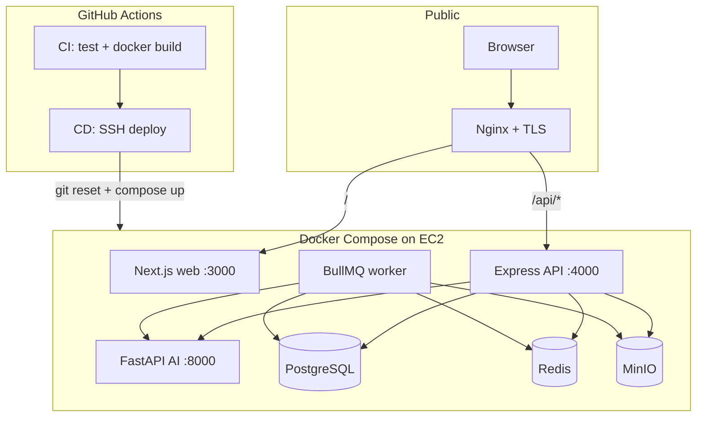
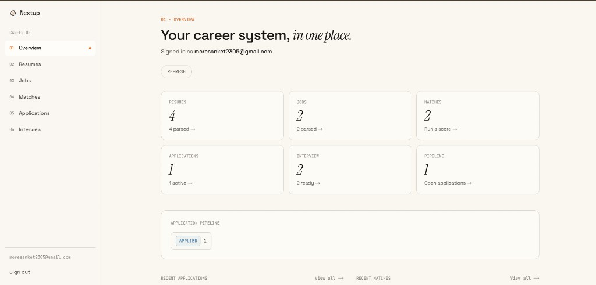
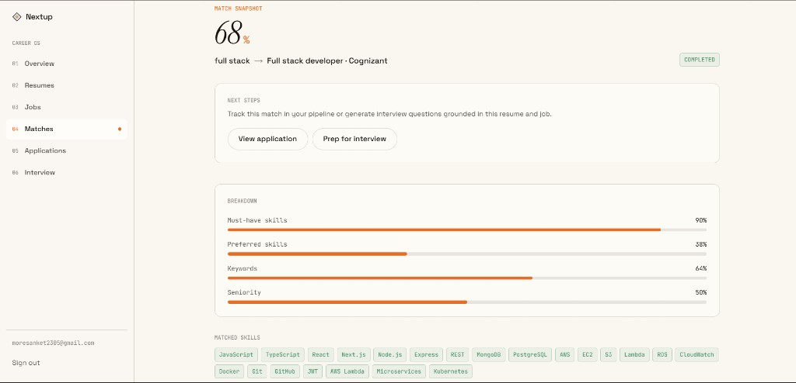

<p align="center">
  <strong>Nextup</strong><br/>
  <em>Job & Resume Intelligence Platform</em>
</p>

<p align="center">
  Upload a resume · Match it to a JD · Track applications · Prep for interviews
</p>

<p align="center">
  <a href="https://nextup-sanket.duckdns.org"></a>
  &nbsp;
  
  
  
  
  
</p>

<p align="center">
  <a href="https://nextup-sanket.duckdns.org"><strong>Open live demo →</strong></a>
  &nbsp;·&nbsp;
  <a href="./docs/README.md">Docs index</a>
  &nbsp;·&nbsp;
  <a href="./docs/phase-7-deploy.md">EC2 deploy from scratch</a>
</p>

---

## Why Nextup?

Job hunting tools are usually scattered: one place for resumes, another for tracking apps, another for interview questions. **Nextup** is a single career OS:

1. **Parse** your PDF resume and pasted job descriptions  
2. **Score** fit with clear skill gaps and recommendations  
3. **Track** applications through a real pipeline  
4. **Practice** with **15** role-grounded interview questions (5 technical / 5 behavioral / 5 project) plus coach guides and sample answers  

Built as a production-minded monorepo: auth, validation, async workers, **CI + CD**, and a real HTTPS deploy — not a toy CRUD demo.

---

## Live deployment

| | |
|---|---|
| **URL** | [https://nextup-sanket.duckdns.org](https://nextup-sanket.duckdns.org) |
| **Auth** | Email/password + **Google OAuth** |
| **Host** | AWS EC2 (Ubuntu) |
| **Runtime** | Docker Compose (`web`, `api`, `worker`, `ai`, Postgres, Redis, MinIO) |
| **Edge** | Nginx reverse proxy + Let’s Encrypt TLS + DuckDNS hostname |
| **CI/CD** | GitHub Actions — test/build on every PR/push; auto-deploy to EC2 after green CI on `main` |

> Closing Docker Desktop on your laptop does **not** stop the live site. Only stopping the **EC2** instance does. Local and production databases are separate.

**Recreate on a new AWS account:** follow **[docs/phase-7-deploy.md](./docs/phase-7-deploy.md)** (EC2 → Docker → `.env` → DuckDNS → Nginx/`nano` → Certbot → Google OAuth → GitHub secrets).

---

## Resume bullets (portfolio)

Use under a project title like **Nextup — Job & Resume Intelligence Platform**:

- Built a full-stack career SaaS (Next.js, Express/Prisma, FastAPI) for resume parsing, JD matching, application tracking, and AI-assisted interview prep, with email/password and Google OAuth sign-in.
- Designed async PDF/JD parsing with Redis + BullMQ so uploads return immediately while a background worker updates parse status and structured data without blocking the API.
- Implemented deterministic resume–job match scoring with skill-gap recommendations, plus application pipeline stages and grounded interview prep (15 questions across technical/behavioral/project, coach guides + sample answers; Groq → Gemini → template fallback).
- Shipped production on AWS EC2 with Docker Compose, Nginx, Let’s Encrypt, and DuckDNS (HTTPS + Google OAuth), plus GitHub Actions **CI/CD** (typecheck, tests, image builds, and SSH auto-deploy on green `main`).

---

## Product walkthrough

```text
Sign in (Google or email)
        ↓
Upload resume PDF  ──async──►  parsed skills / experience
Paste job description ──async──►  required / preferred / keywords
        ↓
Run match  →  overall score + breakdown + recommendations
        ↓
Track application  →  stages, notes, history
        ↓
Generate interview set  →  15 questions + on-demand coach guides
```

| Module | Highlights |
|---|---|
| **Auth** | JWT access + refresh, Google sign-in, optional password for OAuth-only users |
| **Resumes** | PDF upload to object storage, BullMQ parse worker, live status polling |
| **Jobs** | Paste JD → structured skills/keywords/seniority |
| **Matching** | Deterministic scoring + actionable recommendations |
| **Applications** | Stages (`SAVED` → `OFFER` / `REJECTED`…), notes, history |
| **Interview** | 5+5+5 questions; coach outline + spoken sample answer; Groq → Gemini → templates |

---

## Architecture



| Package | Responsibility |
|---|---|
| [`apps/web`](./apps/web) | Next.js UI, dashboard, OAuth callback |
| [`apps/api`](./apps/api) | REST API, Prisma, enqueue parse jobs |
| [`apps/ai`](./apps/ai) | PDF/JD parsing, interview LLM |
| Worker | Same API image · `node dist/worker.js` |

Browser never talks to FastAPI directly. The API and worker own auth and orchestration.

---

## Tech stack

| Layer | Choices |
|---|---|
| Frontend | Next.js, TypeScript, Tailwind |
| Backend | Node.js, Express, Prisma, Zod, Argon2 |
| Queue | Redis + BullMQ (resume/job parse) |
| AI | Python, FastAPI · Groq / Gemini / heuristics |
| Storage | PostgreSQL · MinIO (S3 API) |
| Auth | JWT + Google OAuth 2.0 |
| CI | GitHub Actions — typecheck, tests, Docker builds |
| CD | GitHub Actions — SSH to EC2, rebuild Compose stack |
| Deploy | AWS EC2 · Docker Compose · Nginx · Certbot · DuckDNS |

---

## Monorepo

```text
resumeanalysis/
├── apps/
│   ├── web/                 # Next.js product UI
│   ├── api/                 # Express API + BullMQ worker
│   └── ai/                  # FastAPI parse & interview
├── docs/                    # PRD, architecture, phase notes, full EC2 guide
├── .github/workflows/
│   ├── ci.yml               # tests + image builds
│   └── deploy.yml           # CD after green CI on main
├── .env.example             # repo-root prod keys (copy on EC2 only)
└── docker-compose.yml       # ${VAR:-localhost} — secrets from server .env
```

---

## Quick start (local)

### Prerequisites

- Node.js 20+  
- Docker Desktop (Postgres, Redis, MinIO, AI)  
- Optional: `GROQ_API_KEY` / `GEMINI_API_KEY`, Google OAuth client  

### Option A — Infra in Docker, apps on host (best for daily work)

```bash
# from repo root
docker compose up -d

cp apps/api/.env.example apps/api/.env
cp apps/ai/.env.example apps/ai/.env
# edit secrets (JWT, INTERNAL_API_SECRET, Google, Groq…)

cd apps/api && npm install && npm run dev          # :4000
cd apps/api && npm run worker:dev                  # required for parsing
cd apps/web && npm install && npm run dev          # :3000
```

| Service | URL |
|---|---|
| Web | http://localhost:3000 |
| API | http://localhost:4000 |
| AI docs | http://localhost:8000/docs |

### Option B — Full stack in Docker

```bash
cp apps/api/.env.example apps/api/.env
cp apps/ai/.env.example apps/ai/.env
# fill secrets — compose uses localhost defaults unless you add a repo-root .env

docker compose --profile app up -d --build
```

Opens web on `:3000`, API on `:4000`, plus `jri-worker`.

> Without the **worker**, uploads stay on **Parsing…** forever.

---

## Environment (high level)

Never commit real `.env` files.

| File | Critical vars |
|---|---|
| `apps/api/.env` | `DATABASE_URL`, Google client secrets, `REDIS_URL`, `S3_*`, `AI_SERVICE_URL` |
| `apps/ai/.env` | `INTERNAL_API_SECRET` (must match), `GROQ_API_KEY`, `GEMINI_API_KEY` |
| **Repo-root `.env` (EC2 only)** | `NEXT_PUBLIC_API_URL`, `CORS_ORIGIN`, `GOOGLE_REDIRECT_URI`, `JWT_*`, `INTERNAL_API_SECRET` — see [`.env.example`](./.env.example) |

Production HTTPS + OAuth + recreate flow: **[docs/phase-7-deploy.md](./docs/phase-7-deploy.md)**.

---

## CI / CD

| Workflow | When | What |
|---|---|---|
| [`.github/workflows/ci.yml`](./.github/workflows/ci.yml) | Push/PR to `main` | Web `tsc` + Vitest, API build, AI import, Docker builds |
| [`.github/workflows/deploy.yml`](./.github/workflows/deploy.yml) | After **green CI** on a **push** to `main` | SSH → `git reset --hard` → `docker compose --profile app up -d --build` |

GitHub secrets for CD: `EC2_HOST`, `EC2_USER`, `EC2_SSH_KEY` (optional `EC2_DEPLOY_PATH`, `EC2_PORT`). Details in the deploy guide.

---

## Documentation

| Doc | Contents |
|---|---|
| [docs/README.md](./docs/README.md) | Phase index & status |
| [Architecture](./docs/architecture.md) | Service boundaries & async flows |
| [Database / ERD](./docs/database.md) | Prisma models |
| [Phase 5 interview](./docs/phase-5-interview.md) | 15 questions + coach guides |
| [Phase 7 DevOps](./docs/phase-7-devops.md) | CI, Docker, Redis queue |
| [Phase 7 Deploy](./docs/phase-7-deploy.md) | **Full EC2 recreate** — nano, Nginx, Certbot, DuckDNS, `.env`, CI/CD |
| [PRD](./docs/PRD-job-resume-intelligence-platform.md) | Requirements |

---

## Project status

| Phase | Focus | Status |
|---|---|---|
| 1–4 | PRD, architecture, database | Done |
| 5 | Backend + AI | Done |
| 6 | Frontend dashboard | Done |
| 7 | CI, Docker, Redis worker, live deploy, **CD** | Done |

Polish shipped: overview dashboard, parse UX, delete/archive, match→apply→interview shortcuts, richer interview prep (15 Q + sample answers), centralized API error mapping, unit tests, GitHub Actions CI/CD.

---

## Screenshots

Drop captures from the live demo into `docs/screenshots/`, then enable:

```markdown
| Login | Dashboard | Match |
| :---: | :---: | :---: |
|  |  |  |
```

Suggested shots: login (Google button), overview, resume detail after parse, match score, interview set with coach guide.

---

## Roadmap (optional next)

- Managed Postgres / S3 instead of on-box volumes  
- Password reset email flow (schema exists)  
- Queue match / interview generation (parse already async)  

---

## License

Private project / portfolio unless a `LICENSE` file is added.
