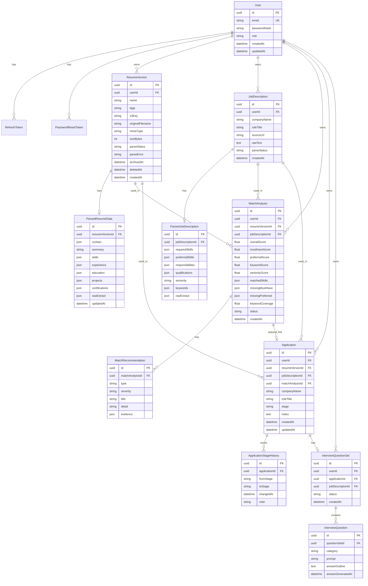

# Database Design (Phase 4)
## AI-Powered Job & Resume Intelligence Platform

**Status:** Approved · Prisma schema at `apps/api/prisma/schema.prisma`  
**Source of truth:** `apps/api/prisma/schema.prisma`

---

## 1. Design Goals

1. **User isolation** — every business row is owned by a `userId` (or reachable only through an owned parent).
2. **Explainable match history** — analyses are immutable snapshots; re-runs create new rows (score deltas over time).
3. **Soft-delete resumes** — deleting a resume version must not break past applications/analyses.
4. **Async job visibility** — parse/AI work has explicit status fields the UI can poll.
5. **Audit for stages** — application stage changes are append-only history rows.
6. **No fabrication in schema** — suggestions/recommendations are stored as proposals, not silently merged into resume text.

---

## 2. ER Diagram



---

## 3. Enums (v1)

| Enum | Values |
|---|---|
| `UserRole` | `USER`, `ADMIN` |
| `JobStatus` | `PENDING`, `PROCESSING`, `COMPLETED`, `FAILED` |
| `ApplicationStage` | `SAVED`, `APPLIED`, `SCREENING`, `INTERVIEW`, `OFFER`, `REJECTED`, `WITHDRAWN` |
| `RecommendationType` | `ADD_SKILL`, `ADD_KEYWORD`, `IMPROVE_BULLET`, `CLARIFY_EXPERIENCE`, `OTHER` |
| `RecommendationSeverity` | `INFO`, `WARN`, `CRITICAL` |
| `QuestionCategory` | `TECHNICAL`, `BEHAVIORAL`, `PROJECT` |

`JobStatus` is reused for resume parse, JD parse, match analysis jobs, and interview generation.

---

## 4. Entity Dictionary

### 4.1 `User`
Account root. Password never stored plaintext (`passwordHash` only).

| Field | Notes |
|---|---|
| `email` | Unique, normalized lowercase |
| `passwordHash` | argon2/bcrypt |
| `role` | Default `USER`; `ADMIN` reserved |

### 4.2 `RefreshToken` / `PasswordResetToken`
Auth support tables (not drawn in full above for clarity).

- Refresh tokens: hashed token, expiry, revoked flag, user FK  
- Password reset: hashed token, expiry, used-at, user FK  

### 4.3 `ResumeVersion`
One named/tagged PDF version belonging to a user.

| Field | Notes |
|---|---|
| `name` | e.g. "Frontend-focused" |
| `tags` | Simple string/json tags for filtering |
| `s3Key` | Object key only — never public URL as source of truth |
| `parseStatus` | Async pipeline status |
| `deletedAt` | Soft delete; queries exclude non-null by default |
| `archivedAt` | Optional archive without full delete |

### 4.4 `ParsedResumeData`
1:1 with `ResumeVersion`. User-editable after AI extraction.

JSON shapes (illustrative):

```json
{
  "contact": { "name": "", "email": "", "phone": "", "links": [] },
  "skills": ["TypeScript", "React"],
  "experience": [
    {
      "company": "",
      "title": "",
      "startDate": "",
      "endDate": "",
      "bullets": [{ "id": "b1", "text": "...", "improvedText": null }]
    }
  ],
  "education": [],
  "projects": [],
  "certifications": []
}
```

`rawExtract` keeps the model/parser dump for debugging; UI edits `skills` / `experience` etc.

### 4.5 `JobDescription` + `ParsedJobDescription`
Paste-first JD library. One JD can power many analyses and applications.

`seniority` example values: `intern` | `junior` | `mid` | `senior` | `lead` | `unknown`

### 4.6 `MatchAnalysis` + `MatchRecommendation`
Immutable run snapshot.

- Scores are **floats written by Express business logic**, not by the LLM.
- `matchedSkills` / missing lists are JSON arrays for fast UI rendering.
- Recommendations are child rows (queryable, typed), each with optional `evidence` (e.g. JD keyword frequency).

Re-run after resume edits → **new** `MatchAnalysis` row (same resumeId + jdId).

### 4.7 `Application` + `ApplicationStageHistory`
Tracks pipeline stage.

- Denormalize `companyName` / `roleTitle` onto Application so dashboard survives JD renames.
- Optional `matchAnalysisId` links the score used when applying.
- Every stage change inserts a history row (`fromStage` nullable on first set).

### 4.8 `InterviewQuestionSet` + `InterviewQuestion`
Generated against a JD / application.

- `answerOutline` starts null; filled on-demand (cost control per PRD).
- Categories: technical / behavioral / project.

---

## 5. Relationships & Cascade Rules

| Parent | Child | On delete |
|---|---|---|
| User | most owned rows | Cascade (account deletion = data deletion) |
| ResumeVersion | ParsedResumeData | Cascade |
| JobDescription | ParsedJobDescription | Cascade |
| MatchAnalysis | MatchRecommendation | Cascade |
| Application | ApplicationStageHistory | Cascade |
| InterviewQuestionSet | InterviewQuestion | Cascade |
| ResumeVersion | MatchAnalysis / Application | **Restrict** while soft-deleted; hard delete only if no dependents, or keep soft-delete forever in v1 |

**v1 policy:** Prefer soft-delete for resumes. Do not hard-delete resume rows that are referenced by applications/analyses.

---

## 6. Indexes (v1)

| Table | Index | Why |
|---|---|---|
| User | unique(`email`) | Login |
| ResumeVersion | (`userId`, `createdAt`) | List resumes |
| ResumeVersion | (`userId`, `deletedAt`) | Active filter |
| JobDescription | (`userId`, `createdAt`) | JD library |
| MatchAnalysis | (`userId`, `createdAt`) | History |
| MatchAnalysis | (`resumeVersionId`, `jobDescriptionId`, `createdAt`) | Score deltas for pair |
| Application | (`userId`, `stage`) | Dashboard filters |
| Application | (`userId`, `updatedAt`) | Recent activity |
| ApplicationStageHistory | (`applicationId`, `changedAt`) | Timeline |
| RefreshToken | (`userId`), unique(`tokenHash`) | Auth |
| PasswordResetToken | unique(`tokenHash`) | Auth |

---

## 7. Consistency Rules (enforced in API, some in DB)

1. `MatchAnalysis.userId` must equal owner of both resume and JD.
2. `Application.userId` must equal owner of linked resume and JD.
3. Stage transitions must be valid for the product (v1: allow any stage → any other stage, but always log history).
4. Parsed tables are upserted 1:1 — never two parse rows per resume/JD.
5. Interview answer outlines generated only when user requests a specific question.

---

## 8. What we are intentionally NOT modeling in v1

- Billing / subscriptions  
- Team/org tenancy  
- Follow-up reminder scheduler table (notes field only; stretch later)  
- Full file virus-scan metadata  
- Multi-language parse profiles  

---

## 9. Phase 4 exit criteria

- [ ] You understand every entity and why it exists  
- [ ] You approve this ERD (or request changes)  
- [ ] We add Prisma schema + migration **only after approval**  
- [ ] Then Phase 5 starts: Express scaffold around this schema (auth first)

---

## 10. Open questions for you (quick)

Reply with preferences (defaults in parentheses if you skip):

1. **IDs:** UUID (`uuid`) vs cuid — **default: UUID**  
2. **Tags on resumes:** `String[]` (Postgres array) vs JSON — **default: `String[]`**  
3. **Soft-delete only for resumes**, or also JDs/applications? — **default: resumes soft-delete; JD/application hard-delete if unused, else restrict**  
4. **Store improvement suggestions** as their own table later, or reuse `MatchRecommendation`-style rows on resume? — **default: separate `ResumeImprovementSuggestion` table when we hit Phase 5.5 / module FR-5** (not required to create yet if you want schema minimal now)

Recommended for first Prisma cut: include entities in sections 4.1–4.8 **plus** auth token tables; add `ResumeImprovementSuggestion` in the same schema so we don’t migrate twice.
